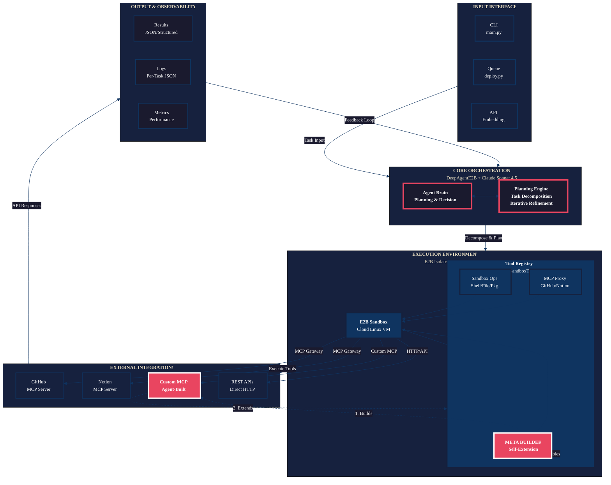

# Deep Agent E2B

Deep Agent E2B is a production-ready autonomous agent stack that fuses the deepagents planning framework with E2B sandboxes and Model Context Protocol (MCP) servers for GitHub and Notion. The result is a single toolchain that can plan, execute, and orchestrate complex developer workflows while keeping execution isolated inside cloud sandboxes.

## Highlights

- Autonomous planning powered by LangChain deepagents and Claude Sonnet 4.5
- Secure E2B sandboxes with built-in shell, file, and package management tools
- First-class MCP integrations (GitHub Official plus Notion) for repo insights and documentation
- Meta MCP Server Builder - the agent can build custom MCP servers to extend its own capabilities
- Deployment-ready server (deploy.py) supporting queue-based workloads and structured logs
- Fully pinned environment via uv.lock for reproducible installs

## Architecture & Pipeline

### Execution Flow

1. Entry point - CLI (main.py, examples.py) or service wrapper (deploy.py) receives a task.
2. Agent bootstrap - DeepAgentE2B loads secrets, spins up an E2B sandbox, and attaches MCP servers based on available tokens.
3. Tool wiring - E2BSandboxTools exposes sandbox commands, file IO, package installs, MCP proxy tools, and MCP builder tools to the agent runtime.
4. Planning and execution - The deep agent decomposes the task, calls tools inside the sandbox, and iterates until completion. Can even build new MCP servers to extend capabilities.
5. Results and logging - Structured responses stream back to the CLI or server, while deploy.py persists JSON logs per task.

### Visual Architecture



### Deployment Surfaces

- `uv run main.py` - interactive chat or single-task CLI
- `uv run examples.py <scenario>` - curated demo workflows
- `uv run deploy.py task "<prompt>"` - one-off automation with JSON result
- `uv run deploy.py server` - persistent worker with queue plus retries

## Setup Playbook (World-Class Edition)

Follow these steps end-to-end to guarantee a reproducible environment.

### 0. Prerequisites

- Python 3.13+
- uv 0.4+ (`uv tool install uv` or `uv tool upgrade uv`)
- API tokens ready:
  - Anthropic (Claude access)
  - E2B (sandbox access)
  - GitHub PAT with repo, read:user, read:org scopes
  - Notion integration token (optional but unlocks Notion workflows)

### 1. Clone & Enter

```bash
git clone https://github.com/e2b-dev/e2b-mcp-py
cd e2b-mcp-py
```

(Optional) keep the virtual environment inside the repo:

```bash
set UV_PROJECT_ENV=.
```

### 2. Install Dependencies

```bash
uv sync
```

uv reads pyproject.toml plus uv.lock, provisions .venv/, and ensures deterministic builds.

### 3. Configure Secrets

```bash
cp .env.example .env   # or use copy on Windows
```

Fill in:

```
ANTHROPIC_API_KEY=sk-ant-...
E2B_API_KEY=e2b_live_...
GITHUB_TOKEN=ghp_...          # if you want GitHub MCP
NOTION_TOKEN=secret_...       # optional Notion MCP
```

The repo automatically loads .env via python-dotenv.

### 4. Smoke Tests

```bash
uv run main.py "List sandbox information"
uv run examples.py github
uv run examples.py code
```

You now have a verified pipeline (Claude <-> deepagents <-> sandbox <-> MCP).

## Environment Variable Reference

| Variable | Required | Purpose |
|----------|----------|---------|
| `ANTHROPIC_API_KEY` | Yes | Used by ChatAnthropic to call Claude Sonnet |
| `E2B_API_KEY` | Yes | Authenticates sandbox creation |
| `GITHUB_TOKEN` | Optional | Enables GitHub MCP actions (repos, issues, etc.) |
| `NOTION_TOKEN` | Optional | Enables Notion MCP actions (pages, databases) |
| `UV_PROJECT_ENV` | Optional | Pin `.venv/` location when using uv |

## Everyday Workflows

### Interactive Agent

```bash
uv run main.py
```

Choose interactive mode (default) and converse with the agent. Type `exit` to quit.

### Single Task

```bash
uv run main.py "Summarize my top 5 GitHub repos and open action items"
```

### Scenario Library

```bash
uv run examples.py github      # Repo intelligence
uv run examples.py notion      # Workspace organization
uv run examples.py sync        # GitHub -> Notion sync
uv run examples.py code        # Arbitrary code execution
uv run examples.py data        # Data-processing pipeline
uv run examples.py package     # pip install + usage
uv run examples.py workflow    # Complex multi-step automation
uv run examples.py all         # Run every example sequentially
```

### MCP Server Builder

The agent can autonomously build custom MCP servers to extend its capabilities:

```bash
uv run example_mcp_builder.py jsonplaceholder
```

This demonstrates the agent building a complete MCP server for the JSONPlaceholder API, including:
- Scaffolding the server structure
- Adding custom tools for API endpoints
- Testing and validating the server
- Deploying it for use

The MCP builder tools enable the agent to:
- `scaffold_mcp_server` - Create a new MCP server template
- `add_mcp_tool_to_server` - Add custom tools to an existing server
- `test_mcp_server` - Validate server syntax and structure
- `deploy_mcp_server` - Deploy the server for use
- `list_mcp_servers` - List all built servers

Built servers are stored in `/home/user/mcp_servers/` within the sandbox and can be integrated with Claude CLI.

### Embedding in Your Own Python

```python
from deep_agent import DeepAgentE2B

with DeepAgentE2B(sandbox_timeout=900) as agent:
    result = agent.invoke("Generate a Notion project tracker from my GitHub data")
    print(result)
```

## Deployment & Operations

### Single-Task Automation

```bash
uv run deploy.py task "Audit my GitHub org and prepare Notion notes"
```

DeepAgentServer boots, runs the task once, prints JSON, and exits. Perfect for CI or ad-hoc workflows.

### Long-Running Worker

```bash
uv run deploy.py server
```

- Polls `/tmp/deep_agent_queue.json` every 10 seconds (adjust via `poll_interval`).
- Writes per-task JSON logs under `/tmp/deep_agent_logs/`.
- Retries failures up to `max_retries` (default 3) and reinitializes the sandbox when needed.

### Queue Producer

```bash
uv run deploy.py queue "Generate release notes for repo foo/bar"
```

Add tasks without restarting the server. Combine with cron, webhooks, or API gateways for automation.

### Operational Tips

- Mount `/tmp/deep_agent_logs` to persistent storage (EFS, volume) in production.
- Wrap `uv run deploy.py server` in systemd, Supervisor, or container orchestrators for resilience.
- Tune `sandbox_timeout`, `log_dir`, and `task_queue_file` via DeepAgentServer constructor or environment variables.
- Export logs to observability stacks for auditing.

## Pipeline Deep Dive

1. Input - CLI args, queue entries, or direct Python calls describe the task.
2. Secret loading - dotenv hydrates tokens so DeepAgentE2B can authenticate with Anthropic, E2B, and MCP servers.
3. Sandbox + MCP - The E2B SDK boots an isolated Linux VM and registers GitHub/Notion MCP through Claude CLI.
4. Tooling - LangChain tools expose sandbox commands, file IO, package installs, GitHub actions, Notion actions, and environment introspection.
5. Agent loop - deepagents orchestrate planning, execution, and subagent spawning until success or error.
6. Logging - CLI pathways print structured summaries; server mode records JSON payloads with timestamps, inputs, outputs, and error metadata for auditing or retries.

## Testing & Troubleshooting

- `uv run main.py "List sandbox information"` - verifies sandbox creation.
- `uv run examples.py code` - ensures shell and file tools function.
- `uv run examples.py package` - validates outbound network plus pip.
- Increase verbosity:

```python
import logging
logging.basicConfig(level=logging.DEBUG)
```

- Sandbox timeout errors -> instantiate `DeepAgentE2B(sandbox_timeout=1200)`.
- MCP authentication errors -> confirm tokens/scopes and Notion page sharing.
- Missing dependency -> rerun `uv sync` (reads `uv.lock`).

## Security Best Practices

- Never commit `.env`; rotate keys regularly.
- Grant least privilege to GitHub and Notion tokens.
- Use short sandbox timeouts and explicit cleanup for long-lived workloads.
- If handling sensitive logs, redirect `/tmp/deep_agent_logs` to encrypted storage.

## Reference & Contribution

- [Deepagents documentation](https://docs.langchain.com/oss/python/deepagents/overview)
- [E2B docs](https://e2b.dev/docs)
- [Model Context Protocol](https://modelcontextprotocol.io/)
- [uv package manager](https://docs.astral.sh/uv/)

## MCP Server Builder (Meta-Capabilities)

The agent includes meta-capabilities to build its own MCP servers, enabling it to extend its functionality autonomously.

### Building Custom MCP Servers

The agent can scaffold, implement, test, and deploy custom MCP servers for any API or service:

```python
from deep_agent import DeepAgentE2B

with DeepAgentE2B() as agent:
    task = """
    Build an MCP server for the JSONPlaceholder API:
    1. Scaffold a server named 'jsonplaceholder'
    2. Add tools: get_posts, get_post, get_user
    3. Test the server syntax
    4. Deploy it locally
    """
    result = agent.invoke(task)
```

### Available Builder Tools

- **scaffold_mcp_server** - Creates a complete MCP server template with proper structure
- **add_mcp_tool_to_server** - Adds custom tools with implementations to an existing server
- **test_mcp_server** - Validates server syntax and verifies tools exist
- **deploy_mcp_server** - Deploys the server for use with Claude CLI
- **list_mcp_servers** - Lists all built servers and their details

### Example: JSONPlaceholder MCP Server

```bash
uv run example_mcp_builder.py jsonplaceholder
```

This example demonstrates building a complete MCP server with three tools:
- `get_posts` - Fetch all posts (with optional limit)
- `get_post` - Fetch a specific post by ID
- `get_user` - Fetch user information by ID

The agent autonomously:
1. Creates the server scaffold
2. Implements each tool with proper error handling
3. Validates the server syntax
4. Deploys it for immediate use

### Use Cases

- Wrap REST APIs as MCP servers
- Create domain-specific tool integrations
- Build custom workflows for internal services
- Extend agent capabilities without code changes

## Contributions

Contributions welcome! Ideas:

- Add more MCP servers (Jira, Slack, etc.)
- Enhance MCP builder with runtime testing capabilities
- Back the queue with Redis or SQS for distributed workers
- Instrument tracing or metrics (OpenTelemetry, Prometheus)
- Publish additional scenario templates or runbooks

## License

MIT - see `LICENSE`.

---

Built with Deep Agents plus E2B sandboxes.
